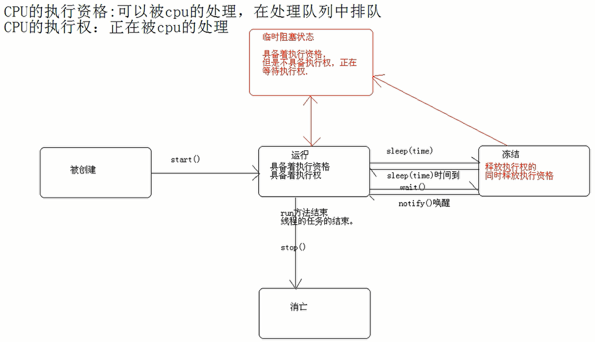

# 线程基本知识

## 1. 进程和线程
- 进程：正在执行中的程序，程序执行中的一片内存空间
- 线程：进程中的一个执行单元，负责进程中程序的运行，一个进程中至少有一个线程，有多个线程的程序也称为多线程程序
## 2. 多线程应用
- 多线程可以实现多部分程序同时运行（并不是真正的同时运行），也称为**并发**
- 多线程的使用可以合理使用CPU资源，但是线程过多会导致降低CPU性能
## 3. 概念
- main是主线程的名称
- Thread.getName()可以获取线程名称

## 4. 创建线程的方法
### 法一：继承Thread类
1. 继承Thread类
2. 重写run()方法
3. 创建子类对象，即创建线程对象
4. 调佣start()方法

### 法二：实现Runnable接口
1. 定义类实现Runnable接口
2. 覆盖run方法，并将线程的任务代码封装到run()方法中
3. 通过Thread类创建线程对象，并将Runnable接口的子类对象作为构造函数的参数进行传递
4. 线程对象调用start()方法开启线程

#### 实现Runnable接口的好处
1. 按照面向对象的思想，将任务封装成了对象。将线程的任务从线程的子类中分离出来
2. 避免了java单继承的局限性

> Thread.currentThread().getName() 获取当前线程名称

## 5. 线程的状态

> 执行资格：可以被CPU处理，但是在队列中排队
> 执行权：正在被CPU处理

### ① 被创建

### ② 被运行
- 具备执行资格
- 具备执行权

### ③ 被销毁

### ④ 被冻结
- 释放执行权的同时，释放执行资格

### ⑤ 临时阻塞状态
- 具备执行资格
- 不具备执行权，正在等待执行权



## 6. 线程间通信
> 生产者-消费者模式
```text
生产者和消费者同时运行，需要用到多线程。二者执行的任务不同，但操作的资源是相同的。
```
- **生产者**：
生产者生产资源，生产一个资源后，处于wait()状态，使用notify()通知消费者可以消费了


- **消费者**：
消费者消费资源，消费了资源后，处于wait()状态，使用notify()通知生产者可以继续生产了


- **多生产者和多消费者问题**：

> 等待唤醒机制
```text
wait(); // 让线程处于冻结状态，被wait的线程会被放入到线程池中
notify(); // 唤醒线程池中的任意线程
notifyAll(); // 唤醒线程池中的所有线程
```

`过程`：
1. 描述资源
2. 定义生产者继承Runnable接口
3. 定义消费者继承Runnable接口

